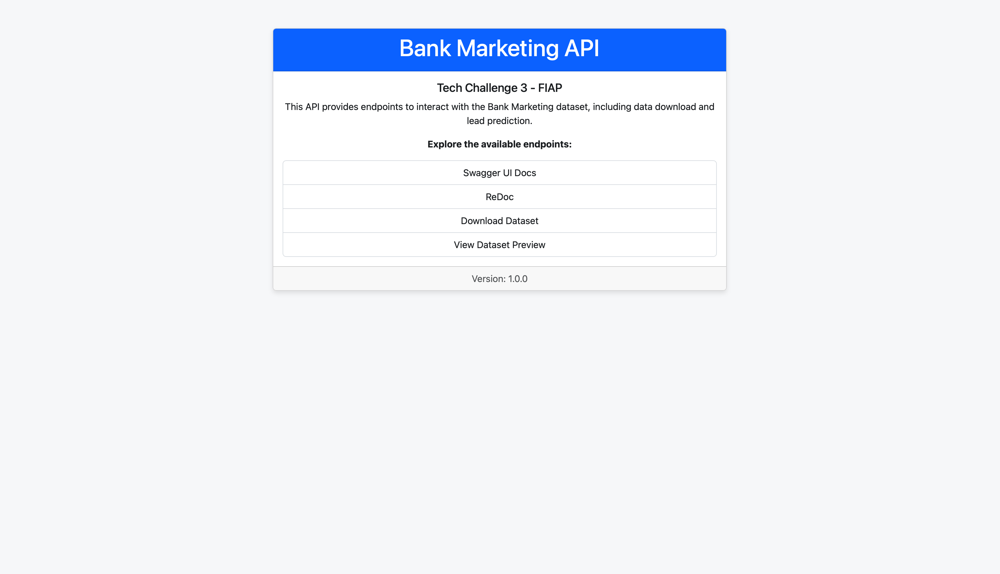

# Bank Marketing Lead Conversion Prediction

<div align="center">

  
  
  
  
  
  
  
  
  
  

</div>

---

This project applies Machine Learning Engineering techniques to the [Bank Marketing dataset from the UCI repository](https://archive.ics.uci.edu/dataset/222/bank+marketing) to predict whether a customer will subscribe to a term deposit after a marketing campaign.

The **primary goal** is to build a **classification** model and serve it through a scalable API, complemented by an interactive web interface for real-time predictions.


## Quick Start

This script automates the setup and runs the data processing and model training pipelines.

```bash
# 1. Clone the repository
git clone https://github.com/luuisotorres/FIAP-Tech-Challenge-3.git
cd FIAP-Tech-Challenge-3

# 2. Install dependencies and set up the environment
uv sync
cp .env.example .env

# 3. Run the data and training pipelines
uv run -m scripts.make_dataset
uv run -m scripts.train_model

# 4. Launch the API and Streamlit app in separate terminals
# Terminal 1:
uv run uvicorn src.app.api:app --reload

# Terminal 2:
uv run -m streamlit run frontend/streamlit_app.py
```


## Table of Contents

- [Features](#features)
- [Tech Stack](#️tech-stack)
- [Project Structure](#project-structure)
- [Getting Started](#getting-started)
- [How to Run](#️how-to-run)
- [API Usage](#api-usage)
- [Streamlit Application](#️streamlit-application)
- [Authors](#authors)


## Features

- **FastAPI Backend**: A high-performance API to serve the machine learning model.
- **Streamlit Frontend**: An interactive web application for making predictions without technical knowledge.
- **Automated ML Pipeline**: Scripts to process data and train the model, ensuring reproducibility.
- **Environment Management**: Uses [uv](https://docs.astral.sh/uv/) for fast and reliable dependency and environment management.


## Tech Stack

- **Python**: Core programming language.
- **FastAPI**: For building the prediction API.
- **Streamlit**: For the interactive user interface.
- **Scikit-learn & LightGBM**: For model training and building pipelines.
- **Pandas**: For data manipulation and processing.
- **Uvicorn**: ASGI server for the FastAPI application.
- **uv**: For environment and package management.


## Project Structure

The project is organized to separate concerns, making it modular and scalable:

```
.
├── assets/              # Screenshots and images for documentation
├── data/                # Datasets (raw, interim, processed)
├── frontend/            # Streamlit application source code
├── models/              # Trained model artifacts
├── notebooks/           # Jupyter notebooks for EDA, model training, and pipeline building
├── scripts/             # Standalone scripts for data processing and model training
├── src/                 # Main source code
│   ├── app/             # FastAPI application (API endpoints, schemas)
│   ├── data/            # Data handling modules
│   └── models/          # Model-related modules (training, prediction)
├── .github/             # GitHub Actions workflows
├── pyproject.toml       # Project metadata and dependencies
└── README.md            # This file
```


## Getting Started

### 1. Environment Setup

This project uses [uv](https://github.com/astral-sh/uv) for dependency and virtual environment management.

**Clone the repository:**
```bash
git clone https://github.com/luuisotorres/FIAP-Tech-Challenge-3.git
cd FIAP-Tech-Challenge-3
```

**Install dependencies:**
This command creates a virtual environment (`.venv`) and installs all required packages from `pyproject.toml`.
```bash
uv sync
```

**Activate the virtual environment:**
```bash
source .venv/bin/activate   # macOS/Linux
.venv\Scripts\activate      # Windows
```

### 2. Environment Variables

The project requires a `.env` file for configuration. Copy the example file to create your own:

```bash
cp .env.example .env
```

The `.env` file contains:
- `FASTAPI_URL`: The URL where the FastAPI backend is running (default: `http://127.0.0.1:8000`).


## How to Run

### 1. Run the ML Pipeline

First, process the data and train the model using the pipeline scripts.

**Generate the dataset:**
This script downloads the raw data and creates a clean version.
```bash
uv run -m scripts.make_dataset
```

**Train the model:**
This script trains the LightGBM model and saves the artifact.
```bash
uv run -m scripts.train_model
```

### 2. Launch the API

Run the FastAPI application using Uvicorn. The `--reload` flag enables hot-reloading for development.

```bash
uv run uvicorn src.app.api:app --reload
```

The API will be available at `http://127.0.0.1:8000`.

### 3. Launch the Streamlit App

In a new terminal, run the Streamlit frontend application.

```bash
uv run -m streamlit run frontend/streamlit_app.py
```

The application will open in your browser, ready to make predictions.


## API Usage

The API provides several endpoints to interact with the model and data.



### API Documentation

Interactive documentation is available at:
- **Swagger UI**: `http://127.0.0.1:8000/docs`
- **ReDoc**: `http://127.0.0.1:8000/redoc`


### Endpoints

- **`GET /`**: Welcome page.
- **`GET /download`**: Downloads and processes the raw dataset.
- **`GET /dataset`**: Shows a preview of the dataset.
- **`POST /predict`**: Makes a prediction based on input features.

**Prediction Example:**

Here's an example of a `POST` request to the `/predict` endpoint and the corresponding response.


**Data Preview:**

Here's a screenshot of dataset preview.


## Streamlit Application

The Streamlit app provides an intuitive interface to predict lead conversion. Fill in the customer details in the sidebar and click "Predict Lead Outcome."

**Main Interface:**


**Prediction Result:**
The result shows whether the lead is likely to subscribe, along with the prediction probability.


## Authors

This project was developed for the **Machine Learning Engineering Postgraduate Program** by:  
* Izabelly de Oliveira Menezes | [Github](https://github.com/izabellyomenezes)
* Larissa Diniz da Silva | [Github](https://github.com/Ldiniz737)
* Luis Fernando Torres | [Github](https://github.com/luuisotorres)
* Rafael dos Santos Callegari | [Github](https://github.com/rafaelcallegari)
* Renato Massamitsu Zama Inomata | [Github](https://github.com/renatoinomata)